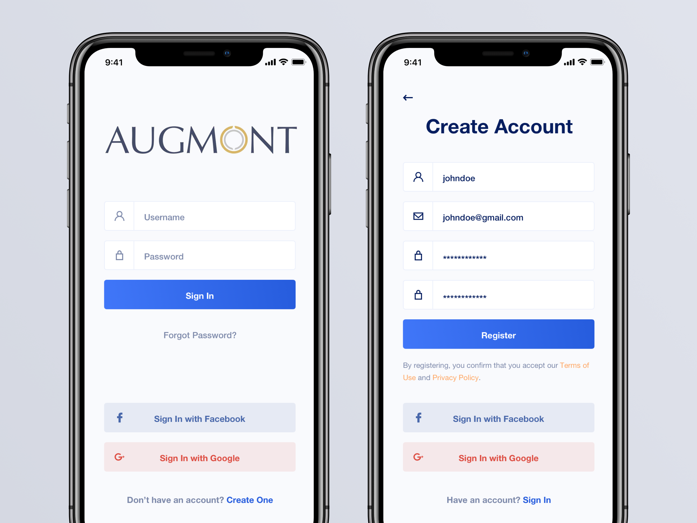

# 
Augmont Gold - Mobile Technical Exercise

Thanks for interviewing with us @ Augmont Gold, to better assess your skills and experience, we would like you to take this short technical exercise.

Please follow the following instructions to complete your exercise.

1. Create a new private repository (GitHub) for your exercise and add `bob224` as private collaborators.
2. Complete as much of the exercise as you can in 4 hours or less. You can use any language, Flutter, Swift or Kotlin (purely because those are the languages we use)
3. Be sure to include the following in your submission

- a README.md with the following information
  - A few screenshots of the finished product. Show off that work!
  - A short explanation of what you built
  - How to test/demo/run (if applicable)
    - NOTE: a 'working' exercise is awesome, however it is NOT a hard requirement. We mean it!
  - Any feedback/notes (i.e. if something was hard, confusing, frustrating, etc)
  - Anything else you'd like us to know about your submission
- a ROADMAP.md with what you would add/change if you had more time. Dream big.
- a super-simple test suite if applicable (even one test is a bonus)
- Some form of lightweight technical documentation (code comments are fine)

4. When complete email a link to the repository and any special instructions back to me.

---

For your exercise, create a mobile app that allows a user to Register for an account with the following information:

- Name
- Email
- Password

On success, redirect the User to a page that displays the information the User provided in the registration form. Add a `logout` mechanism so the User can log out of the session.

Then, create a form to allow the User to login with their email and password.  Redirect the User to a page with their Name and Email displayed on success.

No backend is needed, but connecting to a service like **Google FireBase** for User management or something similar is a HUGE plus.

Do your best to make it look like the design below with good UI interaction and best practices.

## Extras:

- Integrate with Google Firebase for User management
- Integrate social media login for federated identity management
